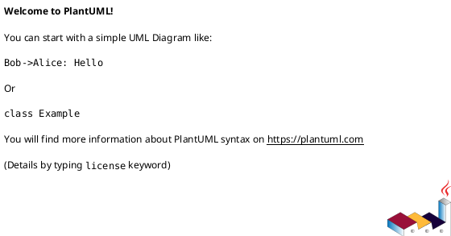

# 提案書向け システム観点レビュー作成スキル

## 目的

提案書に対して、プロダクト価値だけでなく「実装・運用・セキュリティ・障害・コスト」の観点を追加する。
特に、サブエージェントが提案書ドラフトを作った後、人間レビュー前に技術的な抜け漏れを補うために使う。

このスキルは、最終判断を代替しない。AI Agent は以下を担当する。

- システム観点レビュー章の作成
- BE構成案とメリット・デメリット整理
- コスト・セキュリティ・障害点・キャッシュ戦略の洗い出し
- 未確認事項と判断事項の明確化
- 必要に応じて、AIYGIN/business の `planning/` 配下へ提案書を追加し、PR化する
- PRに対して、システム観点レビューコメントを残す

## 使うタイミング

以下の依頼で使う。

- 「提案書にシステム観点のレビューを入れたい」
- 「コスト、BE構成、セキュリティ、障害点、キャッシュを見て」
- 「提案書を技術レビュー込みにして」
- 「cronスクレイピング、無料API、mockのメリデメを比較して」
- 「提案書をplanningに入れてPRにして」
- 「サブエージェントで作った提案書をPRにしてコメントして」

使わないケース:

- 実装コードの詳細レビューのみが目的の場合
- 本番インフラ設計の最終承認
- 法務・投資助言該当性・金融ライセンスの最終判断

## 前提

- 日本語で書く。
- 事実、仮定、要確認を分ける。
- 投資・金融系の提案では、売買推奨・銘柄推奨・将来予測に見える表現を避ける。
- コストは、確定値がなければ断定せず「初期実装コスト」「運用コスト」「外部データ/API取得コスト」「コストを抑える方針」に分ける。
- 外部データ/API取得コストは原則として抑える。無料APIも、レート制限・商用利用・将来有料化・運用保守を含めて評価する。
- キャッシュは無料ではない。DB/Redis/ファイル保存の運用費、実装費、古いデータ表示リスクを必ず書く。
- BE構成は最低3案を、観点ごとのマトリックスで比較する。
  - cronによるスクレイピング
  - 無料API利用
  - mockデータ開始
- 可能なら「推奨方針」を1つに絞る。
- システム構成はPlantUMLで出力する。

## 標準追加章

提案書には次の章を追加する。

```markdown
## <番号>. システム観点レビュー

### <番号>.1 前提整理
#### 事実
#### 仮定
#### 要確認

### <番号>.2 BE構成案マトリックス
| 観点 | 案A: cronスクレイピング | 案B: 無料API | 案C: mockデータ開始 |
|---|---|---|---|
| 初期実装コスト |  |  |  |
| 外部データ/API取得コスト |  |  |  |
| 運用・保守コスト |  |  |  |
| データ網羅性 |  |  |  |
| データ鮮度 |  |  |  |
| 安定性 |  |  |  |
| 規約・ライセンスリスク |  |  |  |
| 障害時の影響 |  |  |  |
| v1適性 |  |  |  |

#### 推奨方針

### <番号>.3 システム構成案（PlantUML）


### <番号>.4 BFF API設計上の確認点

### <番号>.5 コスト観点
#### 初期実装コスト
#### 外部データ/API取得コスト
#### 運用コスト
#### キャッシュコスト
#### コストを抑える方針

### <番号>.6 セキュリティリスク
| リスク | 内容 | 対策 |
|---|---|---|

### <番号>.7 障害点と対策
| 障害点 | 想定される影響 | 対策 |
|---|---|---|

### <番号>.8 キャッシュ導入検討
#### 導入目的
#### キャッシュ対象
#### 推奨方針
#### 要確認

### <番号>.8 表現・コンプライアンス上の注意

### <番号>.9 判断事項
```

## サブエージェント活用手順

提案書が長い、または技術観点が多い場合は、サブエージェントにシステム観点レビュー章の初稿を作らせる。

親エージェントは以下を必ず行う。

1. サブエージェントに、提案書の目的・v1対象外・API案・必要観点を渡す。
2. サブエージェントには「章としてそのまま貼れるMarkdown」「日本語」「事実/仮定/要確認の分離」を指定する。
3. サブエージェントの自己申告を信用せず、作成ファイルを親エージェントが読み返す。
4. 提案書に貼る前に、投資助言・法務判断・未確認事項の断定がないか確認する。
5. 最終提案書を親エージェントが保存し直す。

## AIYGIN/business へのPR化手順

ユーザーが「planningに入れてPRにして」「AIYGIN/businessへPR」と依頼した場合は、`github-workflows` を併用し、以下を実行する。

実例メモ:

- `references/aiygin-business-planning-pr.md`: AIYGIN/business の `planning/` 配下へ提案書を追加し、PR化してシステム観点レビューコメントを残すときの成功パターンと注意点。

### 1. 事前確認

```bash
gh auth status
git -C /Users/ynaragin/git/business remote -v
git -C /Users/ynaragin/git/business status --short --branch
git -C /Users/ynaragin/git/business fetch origin main --prune
```

確認ポイント:

- remote が `https://github.com/AIYGIN/business.git` を指している。
- 作業ツリーが意図しない変更を含んでいない。
- `main` が `origin/main` と同期している。

### 2. ブランチ作成

```bash
git -C /Users/ynaragin/git/business checkout -B planning/<short-topic> origin/main
```

例:

```bash
git -C /Users/ynaragin/git/business checkout -B planning/portfolio-screen-proposal origin/main
```

### 3. planning配下へ配置

ファイル名は内容が分かる英数字スラッグにする。

```text
planning/<YYYYMMDD>-<short-topic>.md
```

例:

```text
planning/20260621-portfolio-screen-proposal.md
```

### 4. commit / push / PR

```bash
git -C /Users/ynaragin/git/business add planning/<file>.md
git -C /Users/ynaragin/git/business commit -m "docs: add portfolio screen proposal"
git -C /Users/ynaragin/git/business push -u origin planning/<short-topic>
gh -R AIYGIN/business pr create --base main --head planning/<short-topic> --title "docs: ポートフォリオ画面提案書を追加" --body-file /tmp/pr-body.md
```

### 5. PRコメント

PR作成後、システム観点レビューの要点をコメントする。

コメントには最低限以下を含める。

- 推奨BE方針
- 未確認の最重要リスク
- セキュリティ上の注意
- 障害時の対策方針
- キャッシュ導入判断
- 人間レビューで決めるべき事項

例:

```bash
gh -R AIYGIN/business pr comment <PR番号> --body-file /tmp/pr-comment.md
```

## レビュー観点

### コスト

- 初期実装コスト、外部データ/API取得コスト、運用コスト、キャッシュコストを分ける。
- 無料APIは「無料だから低コスト」と断定しない。レート制限、商用利用、データ欠損、将来の有料化を確認する。
- スクレイピングは実装よりも保守コスト・規約確認コストが大きくなる可能性を書く。
- mock開始は低コストだが、正式データ移行時の再設計リスクを書く。
- キャッシュはコスト削減策である一方、保存先の運用費・実装費・古いデータ表示リスクを増やす点を明記する。

### BE構成

- データ取得とBFF応答を分離する。
- 外部データ取得はリクエスト同期ではなく、事前取得・キャッシュ・mockを優先検討する。
- データプロバイダ層を分け、mock/API/scrapingを差し替え可能にする。

### セキュリティ

- 証券口座ログイン情報を扱わない設計を明示する。
- 個人資産情報を保存する場合の影響を分ける。
- 入力値のXSS、API認証/認可、CSRF、レート制限、SSRFを確認する。
- スクレイピング対象URLをユーザー入力にしない。サーバー側allowlistで固定する。

### 障害点

- 外部API停止、レート制限、スクレイピングHTML変更、データ形式変更、未対応商品、入力ミス、BFFエラー、キャッシュ劣化を洗い出す。
- 対策は、リトライ、監視、失敗通知、前回値利用、最終更新日時表示、スキーマ検証、分析対象外比率表示に分ける。

### キャッシュ

- まずETF/投信構成データのキャッシュを優先する。
- ユーザー別分析結果キャッシュは後回しでもよい。
- キャッシュには取得元、取得日時、対象商品、バージョンを持たせる。
- TTLと前回値許容期間を要確認として残す。

## PRコメントテンプレート

```markdown
## システム観点レビューコメント

### 結論
現時点では、v1初期はmockデータでUI/API/分析ロジックを固め、正式データ取得方式は並行検証する方針が最もリスクを抑えやすいです。

### 確認すべき最重要ポイント
1. ETF/投信構成データの取得元、利用条件、更新頻度
2. 無料APIまたはスクレイピングの商用利用可否・規約・レート制限
3. キャッシュTTL、取得失敗時の前回値利用ルール
4. 偏りチェックの閾値と、投資助言に見えない表示文言

### セキュリティ上の注意
- v1ではSBIログイン情報、評価額、取得単価、損益を扱わない方針を維持してください。
- 商品名・メモ欄はXSS対策として保存時/表示時のバリデーションとエスケープが必要です。
- スクレイピング対象はサーバー側allowlistで固定し、ユーザー入力URLを取得対象にしないでください。

### 障害対策
- 外部データ取得失敗時は、前回キャッシュ値を表示するか、分析結果を一部エラーにするかを事前に決めてください。
- 画面にはデータ最終更新日時と取得元を表示し、リアルタイム情報ではないことを明示してください。
```

## 完了条件

- [ ] 提案書にシステム観点レビュー章を追加した。
- [ ] コスト、BE構成案、セキュリティ、障害点、キャッシュを含む。
- [ ] cronスクレイピング、無料API、mockのメリット・デメリットを比較した。
- [ ] 推奨方針と判断事項を書いた。
- [ ] 未確認事項を断定していない。
- [ ] 必要に応じて AIYGIN/business の `planning/` 配下に提案書を追加した。
- [ ] commit、push、PR作成、PRコメントを実行し、URLを確認した。
