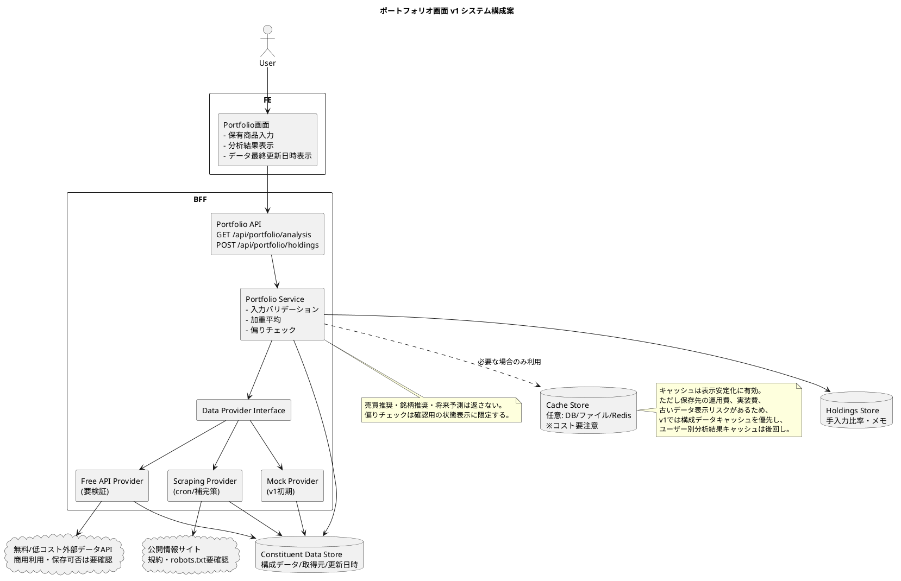

# 提案書ドラフト: ポートフォリオ画面

## 0. エレベーターピッチ

### 30秒版

本提案は、投資分析ツールの利用者が、自分の資産配分と投資方針のズレを短時間で確認できるようにするためのものです。現在は、ETFや投信の中身まで含めた実質的な偏りを一画面で把握しにくい状態です。そこで、手入力した投資比率をもとに、セクター・上位銘柄・国地域・偏りチェックを可視化するポートフォリオ画面をPhase1で実装します。v1では評価額取得や売買推奨を行わず、分析と確認に範囲を絞ります。Phase1のP0機能として実装開始を承認してください。

### 1行版

投資比率の入力だけで、ポートフォリオの偏りを一画面で見える化する提案

### 決裁者にお願いしたいこと

- ポートフォリオ画面をPhase1/P0機能として実装開始することを承認する。
- v1では、SBIログイン連携・評価額自動取得・売買推奨を対象外にする方針を承認する。
- ETF/投信の構成データ取得元を確認する担当者を決める。

### なぜ今か

- Portfolioは、ETF比較・高配当分析の結果をユーザー自身の保有比率に結びつける中核画面である。
- Phase1の主要導線として、共通サイドバーにもPortfolioが配置されている。
- 先にポートフォリオ分析のデータ構造を作ることで、将来のAI要約やRule Monitorに拡張しやすくなる。

### やらない場合の不利益

- ユーザーは「オルカン80%、SCHD20%」のような表面的な比率だけを見て、実質的な米国・テック・上位銘柄集中に気づきにくい。
- ETF比較や高配当分析が単独機能に留まり、自分の保有状況との接続が弱くなる。
- 将来のAI要約に必要な分析データの土台作りが遅れる。

## 1. 人間レビュー用サマリー

- 結論: 投資分析ツールのPhase1機能として、ポートフォリオ画面を優先実装することを提案する。目的は、評価額・損益管理ではなく、手入力した投資比率をもとに「資産配分・ETF/投信の中身・投資方針とのズレ」を可視化することである。
- 意思決定してほしいこと: ポートフォリオ画面をPhase1のP0機能として実装開始してよいかを承認する。
- 最重要確認ポイント:
  1. v1ではSBI連携・評価額取得・売買推奨をしない方針で合意できるか。
  2. ETF/投信の構成比率データをどの公開情報から取得するか。
  3. 偏りチェックの基準値を「一般的な目安」として扱うか、ユーザー個別ルールとして扱うか。

## 2. 提案の骨子

### 対象者・利用者

- 投資分析ツールを使い、自分の保有商品と投資比率を確認したいユーザー。
- オルカン、SCHDなどのETF/投信を組み合わせて運用しているユーザー。
- 評価額や損益だけでなく、資産の中身・偏り・投資方針との整合性を確認したいユーザー。

### 解く課題

- 投資比率だけでは、ETF/投信の中身まで含めた実質的な投資先が見えない。
- セクター、国・地域、上位構成銘柄を個別に調べる手間が大きい。
- 自分の投資方針からどの程度ズレているかを継続的に確認しづらい。

### 提案内容

手入力した保有商品・投資比率をもとに、次の情報を一画面で表示するポートフォリオ画面を実装する。

| 区分 | 表示内容 | v1での扱い |
|---|---|---|
| 保有商品 | 商品名、種別、投資比率、メモ | P0/P1 |
| 外部確認導線 | SBI証券NISAポートフォリオへのリンク | P0 |
| セクター比率 | ETF/投信の構成比率を加重平均 | P0 |
| 上位10銘柄 | 実質的に多く投資している企業 | P0 |
| 国・地域別比率 | 地域分散の確認 | P0 |
| 偏りチェック | 投資方針とのズレを表示 | P0 |
| AI要約 | Coming Soon表示 | P2 |

### 期待効果

- ユーザーが、保有商品の実質的な中身を短時間で把握できる。
- 米国比率、テック比率、上位銘柄集中などの偏りに気づきやすくなる。
- 投資方針に対するズレを「適正」「やや高め」「注意」などで確認できる。
- v1の実装範囲を絞ることで、認証・セキュリティ・投資助言リスクを抑えられる。

### 今回やらないこと

v1では次を実装しない。

- SBIログイン連携
- 評価額自動取得
- 損益管理
- 資産推移グラフ
- 売買推奨
- AIによる銘柄推奨
- リアルタイム株価更新
- 複数ユーザー対応

## 3. SCQAによる論理補強

### S: 現状

投資分析ツールは、Portfolio、ETF比較、高配当分析を主要機能として設計されている。Phase1では、Portfolio、ETF比較、Dividend分析を対象とする方針がある。共通サイドバーではDashboardを持たず、Portfolioを主要導線として配置する設計になっている。

### C: 課題

ユーザーは、SBI証券などで実際の評価額や損益を確認できる一方で、「ETF/投信の中身まで含めて、自分が実質的に何にどれだけ投資しているか」を一画面で把握しにくい。特に、セクター、上位構成銘柄、国・地域の偏り、投資方針とのズレは、複数情報を見比べないと判断しづらい。

このままでは、オルカンやSCHDなどの比率だけを見て分散できていると誤認し、米国・テック・特定銘柄への実質的な集中に気づきにくい。

### Q: 問い

どうすれば、ユーザーが保有商品の評価額管理に踏み込まず、自分の投資方針とのズレを短時間で確認できるか。

### A: 提案

ポートフォリオ画面をPhase1の中核画面として実装し、手入力した保有商品・投資比率をもとに、セクター比率、上位10銘柄、国・地域別比率、偏りチェックを表示する。v1ではAI要約はComing Soonに留め、売買判断・銘柄推奨・SBIログイン連携は実装しない。

## 4. 実行計画

### Step 1: UI実装

担当: フロントエンド担当  
期限: 2026年7月上旬まで（仮置き）

実装内容:

- `/portfolio` 画面を作成する。
- 共通サイドバーから遷移できるようにする。
- ヘッダー、保有商品ブロック、SBIリンクブロックを実装する。
- セクター比率、上位10銘柄、国・地域別比率、偏りチェックのカードUIを実装する。
- AI要約はComing Soon表示にする。

### Step 2: 分析API・データ加工実装

担当: BFF/API担当  
期限: 2026年7月中旬まで（仮置き）

実装内容:

- `GET /api/portfolio/analysis` を実装する。
- `POST /api/portfolio/holdings` を実装する。
- 手入力された保有商品と投資比率を保存する。
- ETF/投信の構成情報を加重平均し、セクター・銘柄・国地域別比率を返す。

### Step 3: 品質確認・受け入れテスト

担当: 開発担当 + 人間レビュー担当  
期限: 2026年7月下旬まで（仮置き）

確認内容:

- オルカン80%、SCHD20%のサンプルが表示される。
- SBI NISAポートフォリオへのリンクが表示される。
- セクター比率、上位10銘柄、国・地域別比率が表示される。
- 偏りチェックが表示される。
- AI要約はComing Soonとして表示される。
- 評価額・損益・資産推移は表示しない。
- 売買判断や銘柄推奨を表示しない。

## 5. 数字・根拠の確認リスト

| 記述 | 必要な出典 | 現状 | 確認担当 |
|---|---|---|---|
| Phase1対象がPortfolio、ETF比較、Dividend分析である | `master.md`の計画、プロジェクト方針 | ローカル設計資料に記載あり | プロダクト担当 |
| v1ではSBI連携・評価額自動取得をしない | `ポートフォリオ画面.md`のv1対象外定義 | ローカル設計資料に記載あり | プロダクト担当 |
| オルカン80%、SCHD20%を受け入れ条件にする | `ポートフォリオ画面.md`の受け入れ条件 | ローカル設計資料に記載あり | 開発担当 |
| 米国比率59.1%、テック比率26.0%などの表示例 | ETF/投信構成比率の公式公開情報 | サンプル値。正式値は要確認 | データ担当 |
| SBI NISAポートフォリオURL | SBI証券公式ページ | 設計資料上のURL。最新URLは要確認 | 開発担当 |
| 偏りチェックの目安値 | ユーザー投資方針または一般的な目安 | 仮置き。正式ルール要確認 | プロダクト担当 |
| 実装期間3〜4週間 | 開発体制・既存コード量・データ取得難易度 | 仮置き | プロジェクト責任者 |

## 6. 決裁者からの想定質問

| 質問 | 回答案 | 追加で必要な情報 |
|---|---|---|
| なぜ最初にポートフォリオ画面を作るのか | 投資分析ツールの入口であり、ETF比較・高配当分析の結果をユーザー自身の保有比率に結びつける中核画面だからです。 | Phase1の優先順位合意 |
| なぜSBI連携をv1でやらないのか | 認証・セキュリティ・保守負荷が大きく、v1の目的である「投資比率ベースの可視化」には必須ではないためです。 | SBI連携の将来要否 |
| 評価額や損益を出さないと価値が弱くないか | v1では実際の評価額確認はSBI証券への導線で補完し、本画面は「資産の中身と偏り」に特化します。 | ユーザーニーズ確認 |
| データの正確性はどう担保するのか | ETF/投信の公開情報を取得元として明記し、最終更新日時とデータ注記を表示します。正式な取得元・更新頻度は要確認です。 | 取得元、更新頻度、利用条件 |
| 投資助言に該当しないか | 売買推奨、将来予測、銘柄推奨を表示せず、偏りや注意点の説明に限定します。必要に応じて免責文を表示します。 | 法務・コンプライアンス確認 |
| AI要約はいつ入れるのか | v1ではComing Soonに留め、P2としてデータ構造と表現方針が固まった後に追加します。 | AI要約の実装時期 |

## 7. 弱点と改善案

最も弱いセクションは「データ取得方針」である。

理由:

- ETF/投信の構成比率をどの公開情報から取得するかが未確定。
- 取得頻度、更新失敗時の扱い、データライセンス、スクレイピング可否が未確認。
- サンプル値を正式値のように見せると、ユーザーに誤解を与える可能性がある。

改善案:

提案承認前に、最低限次の3点を決める。

1. オルカン、SCHDなど主要商品のデータ取得元を1つずつ確定する。
2. データ更新頻度を「日次」「週次」「手動更新」のいずれかに決める。
3. 取得失敗時は、前回取得値を表示するのか、エラー表示にするのかを決める。

この3点を決めれば、実装見積もりとリスク判断がしやすくなる。

## 8. システム観点レビュー

### 8.1 前提整理

#### 事実

- v1の目的は、ユーザーが手入力した保有商品・投資比率をもとに、セクター比率、上位10銘柄、国・地域別比率、偏りチェックを表示することである。
- v1では、SBIログイン連携、評価額の自動取得、損益管理、売買推奨、AIによる銘柄推奨は実装しない。
- BFF API案として、以下の2 APIを想定している。
  - `GET /api/portfolio/analysis`
  - `POST /api/portfolio/holdings`

#### 仮定

- ユーザーの入力値は「銘柄・商品コード、商品名、投資比率、任意メモ」程度に限定する。
- v1では個人の証券口座情報、ログインID、パスワード、評価額、取得単価、損益は保持しない。
- ETF/投信の構成比率データは、外部公開情報または事前に用意したmockデータをもとに表示する。
- 偏りチェックは投資判断を促すものではなく、入力比率と構成データから機械的に算出した「確認用の状態表示」として扱う。

#### 要確認

- ETF/投信構成データの正式な取得元、利用条件、更新頻度。
- スクレイピングを行う場合の対象サイトの規約、robots.txt、負荷制限。
- 無料APIを使う場合の商用利用可否、レート制限、取得可能項目。
- 偏りチェックの閾値を誰が定義・承認するか。
- 投資助言に見えないための文言、免責表示、法務・コンプライアンス確認の要否。

### 8.2 BE構成案マトリックス

比較を読みやすくするため、構成案ごとの説明ではなく、判断観点ごとのマトリックスで整理する。
外部データ/API取得コストはできるだけ抑える前提とし、v1では「外部データ取得にお金をかける前に、画面価値とAPI契約を検証する」方針を優先する。

| 観点 | 案A: cronスクレイピング | 案B: 無料API | 案C: mockデータ開始 |
|---|---|---|---|
| 概要 | cron/スケジューラで公開ページからETF/投信構成情報を定期取得し、DBまたはファイルに保存する | 無料またはフリープランの外部データAPIから構成情報を取得し、BFF内部形式に正規化する | オルカン、SCHDなど代表商品の手動作成データで開始する |
| 初期実装コスト | 中〜高。取得処理、HTML解析、スキーマ検証、監視、リトライが必要 | 中。API接続、レスポンス正規化、レート制限対応が必要 | 低。UI/API/加重平均ロジックに集中できる |
| 外部データ/API取得コスト | API利用料は不要な可能性があるが、規約確認・保守コストが大きい | 無料枠なら直接費用は低いが、制限超過・有料化・商用利用不可のリスクがある | 直接費用は最小。ただし手動更新の人件費と正式移行コストが残る |
| 運用・保守コスト | 高。HTML変更、取得失敗、対象サイト変更への追随が必要 | 中。API仕様変更、無料枠制限、提供停止への追随が必要 | 低〜中。対象商品追加やデータ更新は手動対応になる |
| データ網羅性 | 対象サイト次第。APIがない商品にも対応できる可能性がある | APIが対応する商品に限定される。日本投信は要確認 | 代表商品に限定。実運用データとしては不足 |
| データ鮮度 | 日次/週次など任意に設計可能。ただし取得失敗時は古くなる | APIの更新頻度に依存 | 手動更新頻度に依存。最新性は弱い |
| 安定性 | ページ構造変更に弱い | API仕様が安定していれば比較的高い | 外部依存が少なく、v1検証では最も安定 |
| 規約・ライセンスリスク | 高。robots.txt、利用規約、再配信可否の確認が必須 | 中〜高。商用利用、再配信、保存可否の確認が必須 | 低。ただしデータ出典と手動作成根拠は明記が必要 |
| 障害時の影響 | 取得失敗により最新データが更新されない。前回値利用ルールが必要 | API停止・制限超過で更新不可。キャッシュやフォールバックが必要 | 外部障害の影響は少ないが、データが古くなりやすい |
| キャッシュ相性 | 必須に近い。取得結果を保存しないと画面応答が不安定 | 必須に近い。レート制限対策として保存が必要 | 任意。mock自体が静的データのため、追加キャッシュは不要な場合が多い |
| v1適性 | △。本番運用に近いが、先に規約・保守設計が必要 | ○。条件が合えば有効。ただし無料枠の制約確認が先 | ◎。最小コストで画面価値とAPI契約を検証できる |

#### 推奨方針

- v1初期は「案C: mockデータ開始」を採用し、外部データ/API取得コストを抑えながら、UI/API契約/分析ロジック/投資助言に見えない表現を先に検証する。
- 並行して、無料APIとcronスクレイピングの利用条件を比較する。無料APIは「無料枠で商用利用・保存・再表示が可能か」を確認するまで本採用しない。
- cronスクレイピングは、APIで取得できない商品に限定した補完策として扱う。最初から主方式にすると、規約確認と保守コストが重くなる。
- 本番運用前に、正式データ取得元、更新頻度、キャッシュ保存先、前回値利用ルールを決める。

### 8.3 システム構成案（PlantUML）

v1初期はmockデータを基本とし、後続で無料APIまたはcronスクレイピングを差し替え可能な「データプロバイダ層」をBFF内部に置く。

### 8.4 BFF API設計上の確認点

#### `POST /api/portfolio/holdings`

役割:

- ユーザーが手入力した保有商品と投資比率を保存する。
- v1では評価額、取得単価、損益、証券口座情報は受け取らない。

確認点:

- 投資比率の合計が100%でない場合の扱いを決める。
  - 例: 警告表示のみ、保存不可、100%換算して分析、のいずれか。
- 商品コードが未対応の場合の扱いを決める。
  - 例: 保存は可能だが分析対象外として表示する。
- 入力値のバリデーションを実装する。
  - 比率は0以上100以下。
  - 商品名・メモは文字数上限を設定。
  - HTMLやスクリプト文字列はエスケープする。

#### `GET /api/portfolio/analysis`

役割:

- 保存済みの保有比率とETF/投信構成データをもとに、分析表示用の結果を返す。
- 返却内容は、セクター比率、上位10銘柄、国・地域別比率、偏りチェック、データ最終更新日時とする。

確認点:

- 分析結果に「売買すべき」「購入推奨」「売却推奨」などの表現を含めない。
- 偏りチェックは「確認ポイント」「比率が高め」「要確認」など、投資判断を直接促さない表現にする。
- 分析対象外の商品がある場合、対象外比率を明示する。
- データ取得元と最終更新日時を返し、画面にも表示する。

### 8.5 コスト観点

#### 初期実装コスト

- mockデータ開始の場合、主なコストはUI実装、BFF API実装、加重平均ロジック、バリデーション、テストである。
- cronスクレイピングまたは無料API連携を同時に入れる場合、データ取得・正規化・監視・失敗時対応の実装コストが追加される。
- 正式な工数は、既存コード構成、認証有無、保存先DB、対象商品数により変わるため要確認。

#### 外部データ/API取得コスト

- 方針として、v1では外部データ/API取得コストを抑える。
- 無料APIは直接費用を抑えられる可能性があるが、商用利用不可、保存不可、レート制限、対象商品不足、将来有料化のリスクがある。
- cronスクレイピングはAPI費用を避けられる可能性があるが、規約確認、壊れた時の修正、監視、リトライ設計の運用コストが発生する。
- mockデータは直接費用が最も低いが、正式データ取得方式への移行コストと、データ鮮度の弱さが残る。

#### 運用コスト

- データ取得元の仕様変更対応。
- ETF/投信構成データの更新確認。
- 取得失敗時の調査、リトライ、通知対応。
- 無料APIの制限超過時の有料プラン移行判断。
- 表示データに関する問い合わせ対応。

#### キャッシュコスト

- キャッシュは外部アクセス削減と表示安定化に有効だが、無料ではない。
- DBに保存する場合、テーブル設計、保存容量、期限切れデータ削除、バックアップ対象の整理が必要になる。
- Redis等を使う場合、追加インフラ費用・運用監視・障害時の復旧方針が必要になる。
- ファイルキャッシュの場合、低コストで始めやすい一方、複数環境・複数インスタンスで整合性が問題になりやすい。
- 古いキャッシュを表示すると、ユーザーが最新データと誤解するリスクがあるため、最終更新日時と取得元表示は必須にする。

#### コストを抑える方針

- v1では対象商品を限定する。
- 評価額・損益・証券口座連携を扱わない。
- 外部データ/API取得はmock開始で直接費用を抑え、無料API/スクレイピングは並行検証に留める。
- キャッシュは最初から大きな仕組みにせず、まず構成データの保存で十分かを確認する。
- ユーザー別分析結果キャッシュは、ユーザー数・入力変更頻度・レスポンス速度の課題が見えてから判断する。
- データ取得方式を差し替えやすいよう、BFF内部で「データプロバイダ層」を分ける。

### 8.6 セキュリティリスク

| リスク | 内容 | v1での対策 |
|---|---|---|
| 証券口座情報の取り扱い | SBIログインID、パスワード、口座情報を扱うと漏えい時の影響が大きい | v1ではログイン連携を実装しない |
| 個人資産情報の保持 | 評価額、取得単価、損益は個人性が高い | v1では投資比率のみを扱い、評価額・損益は保持しない |
| 入力値によるXSS | 商品名・メモ欄にスクリプトを入れられる可能性 | 入力値をサニタイズし、表示時にエスケープする |
| APIの不正利用 | holdings更新APIを第三者に呼ばれる可能性 | 認証・認可、CSRF対策、レート制限を実装する。認証方式は要確認 |
| 外部データ取得処理の悪用 | スクレイピング対象URLやパラメータを外部入力にするとSSRFの恐れ | 取得対象はサーバー側の許可リストで固定する |
| データ誤表示 | 古い構成比率や取得失敗時の値が正しいものとして見える | 最終更新日時、取得元、分析対象外比率、注記を表示する |

### 8.7 障害点と対策

| 障害点 | 想定される影響 | 対策 |
|---|---|---|
| 外部API停止・制限超過 | 最新の構成データを取得できない | キャッシュ済みデータを表示し、最終更新日時と「更新確認中」を表示する |
| スクレイピング失敗 | セクター・銘柄・地域比率が更新されない | 取得処理の監視、リトライ、失敗通知、前回値利用ルールを用意する |
| データ形式変更 | 分析ロジックが壊れる | 取得データのスキーマ検証、異常値検知、テスト用fixtureを用意する |
| 未対応商品入力 | 分析結果が欠ける | 未対応商品として表示し、分析対象外比率を明示する |
| 比率入力ミス | 分析結果が誤解を招く | 合計比率、0%未満、100%超過、空値をバリデーションする |
| BFF APIエラー | 画面全体が表示できない | 保有入力エリアと分析結果エリアを分け、分析エラー時も入力内容は表示する |
| キャッシュの古さ | 最新情報と異なる結果を表示する | TTL、最終更新日時、手動更新運用を決める |
| キャッシュ基盤障害 | 分析データが返せない、または外部APIへアクセスが集中する | v1ではキャッシュ依存を強くしすぎず、mock/前回保存データ/一部エラー表示へフォールバックする |

### 8.8 キャッシュ導入検討

#### 導入目的

- 外部APIやスクレイピング対象へのアクセス回数を減らす。
- 画面表示速度を安定させる。
- 外部データ取得に失敗した場合も、前回取得値で限定的に表示を継続する。

#### キャッシュ対象

- ETF/投信の構成データ。
- セクター、上位銘柄、国・地域の正規化済みデータ。
- 必要に応じて、ユーザーの保有比率に基づく分析結果。

#### コスト上の注意

- キャッシュは「コスト削減策」でもあるが、保存先・運用・監視・期限切れデータ管理のコストを増やす。
- v1でRedis等の専用キャッシュ基盤を入れると、追加費用と運用負荷が増える可能性がある。
- まずはDBまたは静的JSON/ファイル保存で十分かを検証し、専用キャッシュ基盤は必要性が見えてから判断する。
- ユーザー別分析結果キャッシュは、ユーザー数が少ない段階では効果より複雑性が上回る可能性がある。

#### 推奨方針

- v1では、まず「構成データの保存」を優先し、外部データの再取得を減らす。
- ユーザー別の分析結果キャッシュは、入力変更頻度やユーザー数が見えてから判断する。
- キャッシュには、データ取得元、取得日時、対象商品、バージョンを持たせる。
- 画面には「データ最終更新日時」を表示し、リアルタイム情報ではないことを明示する。

#### 要確認

- キャッシュ保存先をDB、ファイル、Redis等のどれにするか。
- TTLを日次、週次、手動更新のどれにするか。
- 取得失敗時に前回値を何日まで許容するか。
- ユーザーに古いデータであることをどう表示するか。

### 8.9 投資助言に見えないための表現方針

- 「買うべき」「売るべき」「推奨」「割安」「今が好機」などの表現は使わない。
- 偏りチェックは、投資行動の提案ではなく、入力データに基づく確認項目として表示する。
- 表現例:
  - OK: 「米国比率が設定目安より高めです。投資方針との整合をご確認ください。」
  - OK: 「上位10銘柄への集中度が高めです。」
  - NG: 「米国比率を下げるために他地域のETFを購入しましょう。」
  - NG: 「この銘柄は売却を推奨します。」
- 画面下部または分析カード付近に、次のような注記を置く。
  - 「本画面は、入力された投資比率と公開情報にもとづく確認用の可視化です。特定商品の売買、保有継続、投資判断を推奨するものではありません。」

### 8.10 判断事項

提案承認前に、最低限以下を決める。

1. v1初期はmockデータで開始してよいか。
2. 正式データ取得方式を、cronスクレイピング、無料API、有料API、手動更新のどれで検証するか。
3. ETF/投信構成データの取得元、利用条件、更新頻度の確認担当者を誰にするか。
4. キャッシュ保存先、TTL、取得失敗時の前回値利用ルールをどうするか。
5. 偏りチェックの閾値と表示文言を誰が承認するか。
6. 投資助言に見えないための免責文・表現ルールを法務または責任者が確認するか。

## 9. 人間レビュー欄

- [ ] 事実関係を確認した
- [ ] 数字の出典を確認した
- [ ] 決裁者の関心に合っている
- [ ] 実行責任者が明確
- [ ] 期限・費用・リスクが明確
- [ ] v1対象外の範囲に合意した
- [ ] 投資助言に見える表現がないことを確認した
- [ ] データ取得元・更新頻度・利用条件を確認した
- [ ] BE構成案（mock / 無料API / cronスクレイピング）の比較方針を確認した
- [ ] セキュリティリスク、障害点、キャッシュ方針を確認した
- [ ] 冒頭30秒版だけで提案の価値が伝わることを確認した

## 10. AI作業メモ

- 仮定:
  - 読み手は、投資分析ツールの開発優先順位を判断するプロダクト責任者または開発責任者と仮定した。
  - 意思決定は、ポートフォリオ画面をPhase1/P0として実装開始してよいかの承認と仮定した。
  - 実装期限は仮置きであり、実際のスプリント計画とは未照合。

- 未確認事項:
  - ETF/投信構成データの正式な取得元。
  - 各データの更新頻度。
  - データ利用条件、スクレイピング可否。
  - 偏りチェックの基準値を誰が決めるか。
  - 正式な実装担当者とリリース希望日。
  - 投資助言に見えないための表現・免責方針。

- 次に人間が直すべき箇所:
  - 30秒版が実際の決裁者の関心に刺さる表現になっているか確認する。
  - 期限、担当者、データ取得元を実態に合わせて更新する。
  - サンプル比率を正式データに差し替える。
  - 決裁者が重視する観点に合わせ、費用対効果または開発工数の記述を追加する。
