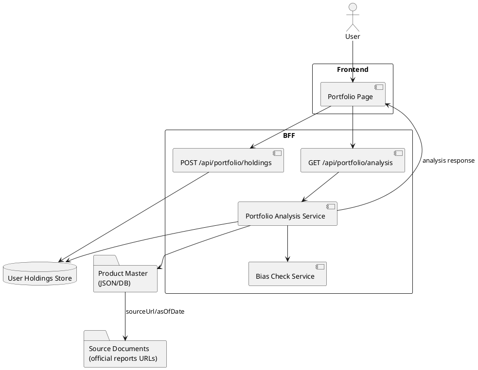

# システムレビュー報告書: ポートフォリオ画面 v1

## 1. 結論

ポートフォリオ画面v1は、個人利用/検証用として「限定商品マスタ + 月次/半手動更新」で開始する方針が最も妥当です。

理由は以下です。

- v1の目的は評価額・損益管理ではなく、手入力比率にもとづく中身可視化である。
- 外部API全面利用は、費用、利用条件、データ再配信、国内投信カバレッジの不確実性がある。
- PDF/サイトスクレイピングは、形式変更・規約確認・保守コストが重い。
- 限定商品マスタなら、P0のUI/API/分析ロジックを先に検証できる。

## 2. 前提整理

### 2.1 事実

- 入力Markdownでは、評価額や損益を管理せず、手入力した投資比率をもとにポートフォリオの中身を可視化する方針が明記されている。
- v1対象外は、SBIログイン連携、評価額自動取得、損益管理、資産推移グラフ、売買推奨、AI銘柄推奨、リアルタイム株価更新、複数ユーザー対応である。
- P0は、保有商品表示、SBIリンク、セクター比率、上位10銘柄、国・地域比率、偏りチェックである。
- BFF API案として `GET /api/portfolio/analysis` と `POST /api/portfolio/holdings` がある。

### 2.2 仮定

- v1は個人利用/検証用であり、一般公開/商用SaaSではない。
- 対象商品は当初4本に限定する。
- 商品自体の追加・入替は年1回程度、構成情報は公式情報をもとに必要に応じて月次/半手動で更新する。
- 投資助言ではなく、可視化と注意喚起に限定する。

### 2.3 要確認

- v1対象4商品の構成情報を取得する公式参照元。
- 商品マスタ/構成情報の更新担当、レビュー方法。
- 公式情報の利用条件。
- 偏りチェック閾値の最終調整要否。
- 未対応商品/admin更新機能を将来構想へ回す前提の確認。

## 3. v1対象商品とデータ出典方針

v1では対象商品を以下の4本に限定する。保有商品の詳細情報は、SBI証券の商品ページおよび運用会社等の公式情報を出典として確認する。

| No | 商品名 | SBI証券URL | 公式情報確認方針 |
|---:|---|---|---|
| 1 | eMAXIS Slim 全世界株式（オール・カントリー） | https://member.c.sbisec.co.jp/fund/detail/0331418A | SBI証券商品ページ、運用会社公式ファンドページ/月次レポートを確認 |
| 2 | SBI・全世界株式インデックス・ファンド | https://member.c.sbisec.co.jp/fund/detail/8931217C | SBI証券商品ページ、SBIアセットマネジメント公式レポートを確認 |
| 3 | SBI・V・S&P500インデックス・ファンド | https://member.c.sbisec.co.jp/fund/detail/89311199 | SBI証券商品ページ、SBIアセットマネジメント公式レポートを確認 |
| 4 | SBI・S・米国高配当株式ファンド（年1回決算型） | https://member.c.sbisec.co.jp/fund/detail/89312259 | SBI証券商品ページ、SBIアセットマネジメント公式レポートを確認 |

商品自体の追加・入替は年1回程度とし、ETF/投信の構成情報は公式情報をもとに必要に応じて月次/半手動で更新する。未対応商品を管理するadmin機能は将来構想とし、v1の必須機能には含めない。

## 4. BE構成案マトリックス

| 観点 | 案A: 限定商品マスタ + 月次/半手動更新 | 案B: 外部API利用 | 案C: PDF/サイトスクレイピング | 案D: mockデータ開始 |
|---|---|---|---|---|
| 初期実装コスト | 低〜中。対象4商品に限定したマスタ設計と検証スクリプトが必要 | 中。API接続・認証・正規化が必要 | 高。抽出処理・例外対応が重い | 低。UI/API形だけ先行可能 |
| 外部データ/API取得コスト | 低。API費用なし | 中〜高。FMP/API Ninjas等は有料機能が必要になる可能性 | 低〜中。API費用は不要でも保守工数が高い | 低。ただし実データ検証はできない |
| 運用・保守コスト | 中。商品自体は年1回、構成情報は公式情報をもとに必要に応じて月次/半手動更新とレビューが必要 | 中。API障害・契約・仕様変更対応が必要 | 高。ページ/PDF形式変更に弱い | 低。ただし本番移行時に再設計リスク |
| データ網羅性 | 低〜中。対象商品に限定 | 中。APIカバレッジに依存 | 中。公開レポートがある商品に依存 | 低 |
| データ鮮度 | 月次中心 | API次第 | 月次中心 | 固定 |
| 安定性 | 高。内部マスタで制御できる | 中。外部依存 | 低〜中。取得先変更に弱い | 高。ただし実用性は低い |
| 規約・ライセンスリスク | 中。出典利用条件は要確認 | 中〜高。表示・再配信・キャッシュ条件確認が必要 | 高。スクレイピング可否確認が必要 | 低 |
| 障害時の影響 | 低。既存マスタで表示可能 | 中。API停止時に影響 | 中〜高。取得失敗が起きやすい | 低 |
| v1適性 | 高 | 中 | 低〜中 | 中。初期UI検証には有効 |

### 推奨方針

- v1本線: 案A「限定商品マスタ + 月次/半手動更新」
- 初期開発補助: 案D「mockデータ開始」を併用し、UI/APIの形を先に固める
- 将来検証: 案B「外部API利用」は対象商品拡大や商用公開の前に再評価する
- 非推奨: 案C「PDF/サイトスクレイピング」はv1では避ける

## 5. システム構成案



## 6. BFF API設計上の確認点

### GET /api/portfolio/analysis

確認点:
- 未対応商品がある場合、分析対象外比率を返すか、エラーにするか。
- 商品比率の合計が100%でない場合の扱い。
- `updatedAt` は分析実行日時か、商品マスタの最終更新日時か。
- `sectorAllocation` と `countryAllocation` の合計誤差をどこまで許容するか。
- `biasChecks` の閾値を設定ファイル化するか。

推奨:
- `dataSources` または各項目に `sourceUrl` / `asOfDate` を持たせる。
- 未対応商品は画面で分かるように `unsupportedHoldings` を返すことを検討する。

### POST /api/portfolio/holdings

確認点:
- `ratio` の範囲、合計値、少数桁数。
- `memo` の最大長とXSS対策。
- `category` の拡張性。現状は `core` / `dividend` だが、将来 `bond`、`cash`、`satellite` が必要になる可能性がある。

## 7. コスト観点

### 7.1 初期実装コスト

- UI、BFF、商品マスタ、分析ロジック、チャート表示、エラー/Empty状態の実装が必要。
- 難所はUIよりも、商品マスタの正規化と検証である。

### 7.2 外部データ/API取得コスト

- v1では外部APIを必須にしない。
- FMP、Alpha Vantage、API Ninjas等のAPI候補はあるが、保有構成データ・国地域/セクター情報・商用利用・キャッシュ可否の確認が必要。
- 将来採用する場合は、表示/再配信/保存条件を契約・規約で確認する。

### 7.3 運用コスト

- 商品自体の追加・入替は年1回程度、構成情報は公式情報をもとに必要に応じて月次/半手動で更新する人手が必要。
- 更新漏れ・転記ミスを防ぐ検証スクリプトが必要。
- 画面上に最終更新日を表示し、古いデータである可能性を明示する。

### 7.4 キャッシュコスト

- 案Aでは商品マスタ自体がキャッシュに近い役割を持つ。
- 将来API化する場合は、外部APIを画面表示ごとに叩かず、日次/月次で取得してDBまたはファイルに保存する。
- キャッシュはコスト削減策だが、古いデータ表示リスクと保存先運用コストを伴う。

### 7.5 コストを抑える方針

- v1対象商品を少数に限定する。
- 外部API契約はv1価値検証後に判断する。
- スクレイピング自動化はv1では避ける。
- 商品マスタ/構成情報更新チェックをスクリプト化し、転記ミスを減らす。

## 8. セキュリティリスク

| リスク | 内容 | 対策 |
|---|---|---|
| XSS | 商品名やメモに任意文字列が入る | 保存時バリデーション、表示時エスケープ、最大長制限 |
| CSRF | holdings保存APIが不正送信される | 認証導入時はCSRF対策、SameSite Cookie設定 |
| 個人資産情報の扱い | 投資比率・メモが個人の投資方針に近い情報になる | v1保存範囲を明確化、不要な評価額/損益を保存しない |
| SSRF | 将来スクレイピングURLをユーザー入力にすると危険 | 取得先はサーバー側allowlist固定。ユーザー入力URLは使わない |
| APIキー漏洩 | 将来外部APIを使う場合にキーが漏れる | サーバー側のみで保持、環境変数管理、ログ出力禁止 |
| 投資助言誤認 | 偏りチェックが売買推奨に見える | 「注意喚起」「一般的な目安」「投資判断は自己責任」と明示 |

## 9. 障害点と対策

| 障害点 | 想定される影響 | 対策 |
|---|---|---|
| 商品マスタ更新漏れ | 古い構成比率が表示される | 最終更新日表示、更新期限アラート、月次更新チェック |
| 商品マスタの転記ミス | セクター/国地域/上位銘柄比率が誤る | 合計比率検証、レビュー、差分確認 |
| 未対応商品入力 | 分析結果が不完全になる | 未対応商品として明示、分析対象外比率を表示 |
| 比率合計が100%でない | 加重平均が歪む | 登録時警告、正規化するか要確認 |
| BFFエラー | 画面が表示できない | Error状態、再読み込みボタン、ログ出力 |
| チャート描画失敗 | 分析結果が読めない | テーブル表示を併用する |
| 将来外部API停止 | データ更新不能 | 前回マスタ利用、失敗通知、再試行 |

## 10. キャッシュ/データ保持方針

### 導入目的
- 外部API依存を避ける。
- 表示速度を安定させる。
- 同じ商品構成データを再利用する。

### キャッシュ対象
- 商品マスタ
- セクター比率
- 国・地域別比率
- 上位構成銘柄
- 出典URL
- 基準日/更新日

### 推奨方針
- v1では商品マスタをJSONまたはDBで保持する。
- `asOfDate`、`sourceUrl`、`dataVersion` を必須にする。
- ユーザー別分析結果のキャッシュは後回しにし、まず商品構成データの安定性を優先する。

### 要確認
- 商品マスタをコード管理するか、DB管理するか。
- 月次更新のレビュー手順。
- 古いデータを何日まで許容するか。

## 11. 既存サービス・代用手段との比較

| 代替手段 | 内容 | 今回内製する理由/注意点 |
|---|---|---|
| Morningstar X-Ray | 複数ETF/投信を含むポートフォリオ分析が可能 | 既存機能として参考になるが、投資分析ツール内のSBI導線・独自UI・将来AI要約とは別体験 |
| Portfolio Visualizer | ポートフォリオ分析・バックテスト・AI説明を提供 | 高機能だが、今回のv1は手入力比率ベースの軽量可視化に限定 |
| SBI証券画面 | 実際の保有状況・評価額・損益を確認可能 | 本提案ではSBIを置き換えず、実際の評価額確認導線としてリンクする |
| Google Sheets手動管理 | 低コストで柔軟 | UI/注意喚起/将来AI要約の土台としては弱い |


## 12. 偏りチェック表示仕様の反映

PRコメントの画面イメージに合わせ、v1の偏りチェックは以下を初期表示例とする。これは売買推奨ではなく、一般的な目安にもとづく注意喚起として扱う。

| 項目 | 表示例 | 目安 | 判定文言 |
|---|---:|---|---|
| 米国比率 | 59.1% | 50%以下 | やや高め |
| テック比率 | 26.0% | 20%前後 | やや高め |
| 高配当比率（SCHD系） | 20.0% | 20〜30% | 適正範囲内 |
| 新興国比率 | 10.4% | 5〜20% | 適正範囲内 |
| 債券比率 | 0% | 必要に応じて検討 | 未保有 |

画面には以下の注意書きを表示する。

```text
偏りチェックは一般的な考え方に基づく目安です。
最終的な投資判断はご自身の方針に基づいて行ってください。
```

## 13. 提案書本文に反映すべき修正提案

- 「偏りチェック」は「注意喚起」であり、売買推奨ではないと明記する。
- 商品マスタに `sourceUrl`、`asOfDate`、`dataVersion` を持たせる方針を追加する。
- 未対応商品/admin更新機能は将来構想とし、v1必須機能から外す。
- 商品自体は年1回見直し、構成情報は公式情報をもとに必要に応じて月次/半手動更新とする。
- 外部APIは将来検討とし、v1の必須要件から外す。

## 14. 人間レビューで決めるべき事項

1. v1対象4商品の構成情報の公式参照元
2. 商品マスタの保存形式（JSON/DB）
3. 商品自体の年1回見直しと構成情報更新の担当・レビュー手順
4. 偏りチェックの閾値
5. 未対応商品/admin更新機能を将来構想に留める方針
6. 投資助言に見えない文言の最終確認
7. AI要約をP2で入れる場合の責任範囲

## 15. 参考情報

- FMP ETF & Fund Holdings API: https://site.financialmodelingprep.com/developer/docs/stable/holdings
- Alpha Vantage Premium: https://www.alphavantage.co/premium/
- API Ninjas ETF API: https://api-ninjas.com/api/etf
- Morningstar X-Ray: https://www.morningstar.com/help-center/portfolio/xray
- Portfolio Visualizer: https://www.portfoliovisualizer.com/
- eMAXIS Slim 全世界株式（オール・カントリー）: https://emaxis.am.mufg.jp/fund/253425.html
