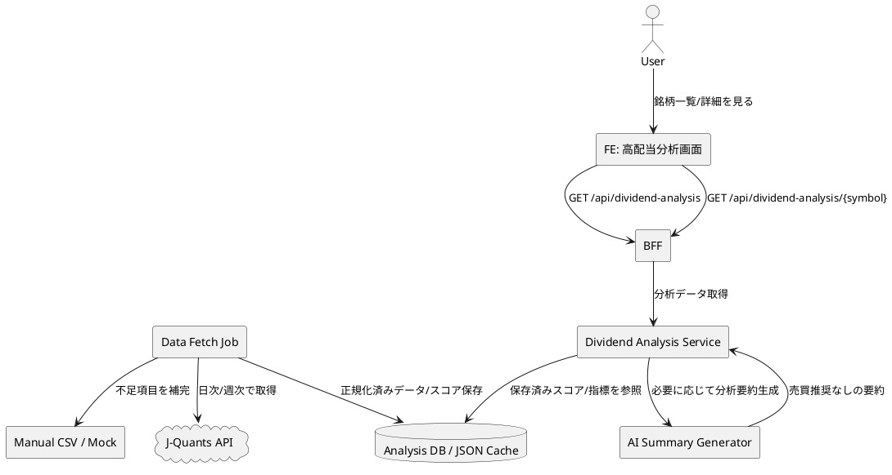

# システム観点レビュー: 高配当分析画面 PoC

## 1. 結論

個人利用/PoCとしては、J-Quants APIを第一候補にしつつ、v1では「事前取得 + 保存済みデータをBFFで返す」構成が最も現実的です。画面リクエストごとに外部APIへ同期アクセスする構成は、レート制限、障害、レスポンス遅延、利用条件確認の面で避けるべきです。

最重要リスクは以下の3つです。

1. J-Quantsの利用条件: 個人の私的利用が前提で、第三者提供や継続反復的な分析結果配信は制限がある。
2. 投資助言誤認: AIサマリーが売買推奨・将来予測・投資判断に見えないようにする必要がある。
3. データ定義: FCF、配当性向、減配履歴、増配率の算出ルールを固定しないとスコアの説明責任が弱い。

## 2. 前提整理

### 事実
- 画面名は「高配当分析」。
- v1対象銘柄は三菱商事、NTT、三菱UFJ、JTの4銘柄固定。
- AIは分析結果の要約のみ行い、売買推奨・将来予測・投資判断は行わない。
- 想定APIは以下。
  - `GET /api/dividend-analysis`
  - `GET /api/dividend-analysis/{symbol}`
- J-Quants APIは日本株の株価・財務・配当等を取得する候補である。
- J-Quantsの利用条件では、個人の私的利用が前提で、第三者向けアプリ提供や継続反復的な分析結果提供は制限がある。

### 仮定
- 用途は個人利用/PoC。
- 一般公開・商用SaaS・外部顧客提供はv1対象外。
- 更新頻度は日次〜週次、または手動更新で許容する。
- 画面表示時点のリアルタイム株価は不要。

### 要確認
- J-Quantsのどのプランで、必要な配当金情報・財務諸表・CFデータが取得できるか。
- FCFを「営業CF − 投資CF」と定義してよいか。
- 三菱UFJのような金融業を、一般事業会社と同じFCFルールで評価してよいか。
- AIサマリーの禁止表現リストとテスト方法。

## 3. BE構成案マトリックス

| 観点 | 案A: J-Quants同期取得 | 案B: J-Quants事前取得 + 保存 | 案C: 手動CSV/mock開始 |
|---|---|---|---|
| 初期実装コスト | 中。API連携は単純だがエラー処理が必要 | 中。取得ジョブと保存設計が必要 | 低。UI/API検証に集中できる |
| 外部データ/API取得コスト | プラン依存。Premiumが必要になる可能性 | 同左。ただし取得頻度を抑えられる | 低。ただし手動作業が発生 |
| 運用・保守コスト | 高。画面アクセスがAPI障害の影響を受ける | 中。取得失敗時に前回値表示が可能 | 中。転記ミスと更新漏れ対策が必要 |
| データ網羅性 | API取得範囲に依存 | API取得範囲に依存。補完しやすい | 手入力範囲に限定 |
| データ鮮度 | 高くできるがv1では過剰 | 日次/週次で十分 | 更新者次第 |
| 安定性 | 外部APIに強く依存 | 比較的高い | 高いがデータ更新は人手依存 |
| 規約・ライセンスリスク | 利用形態確認が必須 | 同左。保存・キャッシュ条件も確認必須 | 取得元ごとの確認が必要 |
| 障害時の影響 | 画面表示に直接影響 | 前回値や一部エラー表示で緩和可能 | 画面は安定するが鮮度低下 |
| v1適性 | 中 | 高 | 中〜高 |

### 推奨方針
v1は案B「J-Quants事前取得 + 保存」を第一候補にする。J-Quantsで不足する項目は手動CSV/mockで補完し、画面表示時はBFFが保存済みデータを返す。これにより、外部API障害やレート制限を画面レスポンスから切り離せる。

## 4. システム構成案（PlantUML）

## 5. BFF API設計上の確認点

### `GET /api/dividend-analysis`
- スコア順で返す。
- 画面で必要な一覧項目だけを返す。
- `updatedAt` と `dataAsOfDate` を分ける。
  - `updatedAt`: システムがデータを更新した日時。
  - `dataAsOfDate`: 指標データの基準日。
- `isRealtime=false` のような明示フラグを持たせる。

### `GET /api/dividend-analysis/{symbol}`
- 指標ごとの根拠値、得点、判定、説明を返す。
- AIサマリーは、可能なら保存済みテキストとして返す。
- データ欠損時は、欠損理由と対象外項目を明示する。

### レスポンス設計上の注意
- 「買い」「売り」「割安」「上昇余地」など投資判断に見えるフィールド名を避ける。
- `recommendation` ではなく `judgement` や `safetyLabel` を使う。
- `prediction` ではなく `analysisSummary` を使う。

## 6. コスト観点

### 初期実装コスト
- UI: 一覧、詳細、チャート、AIサマリー、免責注記。
- BFF: 一覧/詳細API、スコア計算、エラーハンドリング。
- データ取得: J-Quants認証、取得ジョブ、保存形式、欠損補完。
- AI: プロンプト、禁止表現チェック、出力テスト。

### 外部データ/API取得コスト
- J-Quants Freeは0円だが、12週間遅延・5件/分制限がある。
- Lightは1,650円/月、Standardは3,300円/月、Premiumは16,500円/月。
- 配当金情報や財務諸表BS/PL/CFはPremium側に寄るため、FCFと減配履歴の厳密度次第で必要プランが変わる。

### 運用コスト
- 取得ジョブの失敗監視。
- API仕様変更への追随。
- データ欠損・異常値の確認。
- 手動CSV補完時のレビュー。
- AIサマリーの禁止表現テスト。

### キャッシュコスト
- 保存先DBまたはJSONファイルの設計・管理が必要。
- 古いデータを表示するリスクがある。
- ただし、v1では4銘柄固定のため、DBでなくJSON/SQLite等の軽量保存でも検証可能。

### コストを抑える方針
- v1は4銘柄固定にする。
- リアルタイム株価を扱わない。
- J-Quantsで不足する項目は手動CSV/mockで補完する。
- AIサマリーは毎リクエスト生成ではなく、指標更新時に生成/保存する。

## 7. セキュリティリスク

| リスク | 内容 | 対策 |
|---|---|---|
| APIキー漏洩 | J-Quants APIキーがクライアントへ露出する | APIキーはBFF/サーバー側にのみ保存し、FEへ渡さない |
| 不正アクセス | 個人利用でもAPIを公開すると第三者利用され得る | 認証/認可、レート制限、CORS制御を行う |
| XSS | 銘柄名、説明、AIサマリー表示でHTML混入の可能性 | 表示時エスケープ、Markdown制限、サニタイズを行う |
| AI出力リスク | 売買推奨や将来予測を生成する可能性 | 禁止語チェック、プロンプト制約、テストケースを用意する |
| データ改ざん | 手動CSV補完時に誤入力・改ざんが入り得る | source_url、as_of_date、更新者、レビュー状態を持たせる |

## 8. 障害点と対策

| 障害点 | 想定される影響 | 対策 |
|---|---|---|
| J-Quants API停止 | 最新データ取得に失敗 | 前回値を表示し、最終更新日時と警告を出す |
| レート制限 | 取得ジョブが失敗 | 4銘柄固定、バッチ取得、リトライ、バックオフ |
| データ欠損 | スコア計算不能 | 欠損項目を対象外/要確認として表示する |
| 指標定義変更 | 過去スコアとの比較が崩れる | スコア計算バージョンを持たせる |
| AI生成失敗 | サマリーが表示できない | ルールベース文言または前回サマリーを表示する |
| 保存データ破損 | 画面表示不能 | スキーマ検証、バックアップ、再取得手順を用意する |

## 9. キャッシュ/データ保持方針

### 導入目的
- 外部API障害やレート制限の影響を画面表示から切り離す。
- AIサマリー生成コストを抑える。
- いつ時点のデータで分析したかを説明できるようにする。

### キャッシュ対象
- 正規化済み指標データ。
- スコア計算結果。
- AI分析サマリー。
- データ取得元、基準日、取得日時、スコア計算バージョン。

### 推奨方針
- v1は4銘柄固定のため、JSON/SQLite/DBのいずれでもよい。
- 実装側の既存技術スタックに合わせて選ぶ。
- 画面には必ず最終更新日時を表示する。

### 要確認
- J-Quants由来データの保存・キャッシュ条件。
- API契約終了後のデータ削除条件。
- 個人利用/PoCを超えて公開する場合のデータ保持可否。

## 10. 表現・コンプライアンス上の注意

### 禁止すべき表現
- 買うべき。
- 売るべき。
- 今後上がる。
- 今後下がる。
- 投資妙味がある。
- 割安だから買い。
- 目標株価。
- 推奨銘柄。

### 許容しやすい表現
- 安全寄り。
- 注意しつつ良好。
- 注意。
- 危険。
- 過去データ上は、配当持続性の懸念が相対的に小さい。
- FCFが3年連続でプラスである。
- 配当性向は設定レンジ内である。

### 画面に常時表示すべき注記
> 本画面は高配当株の配当持続性を分析するためのものであり、特定銘柄の売買を推奨するものではありません。分析は過去データに基づくものであり、将来の株価・配当・業績を保証するものではありません。

## 11. 提案書本文に反映すべき修正提案

- 「J-Quants前提」は、個人利用/PoCに限定して記載する。
- 公開/商用化する場合は、J-Quants Proや別データ契約の検討が必要と明記する。
- FCF・配当性向・減配履歴の定義固定をPoC Step 1に入れる。
- AIサマリーの禁止表現テストを受け入れ条件に入れる。
- 画面表示時に `dataAsOfDate` と `updatedAt` を表示する要件を追加する。

## 12. 人間レビューで決めるべき事項

1. J-Quantsの利用範囲は個人利用/PoCに限定する理解でよいか。
2. 必要データ取得のために有料プランを許容するか。
3. FCF定義と金融業の扱いをどうするか。
4. AIサマリーの禁止表現リストをどこまで厳密にするか。
5. キャッシュ/保存先は既存BFFのDBに合わせるか、PoC用JSON/SQLiteで始めるか。

## 13. 受け入れ条件への追加提案

- スコア順に表示される。
- スコア内訳が表示される。
- FCFが最上位で表示される。
- AIは分析のみ行う。
- 売買推奨を表示しない。
- 最終判定が表示される。
- スコア計算ロジックが実装されている。
- 詳細画面で各得点理由が確認できる。
- 最終更新日時とデータ基準日が表示される。
- AIサマリーに禁止表現が含まれない。
- J-Quants APIキーがクライアントへ露出しない。
- 外部API取得失敗時に、画面が致命的に壊れず警告を表示できる。
